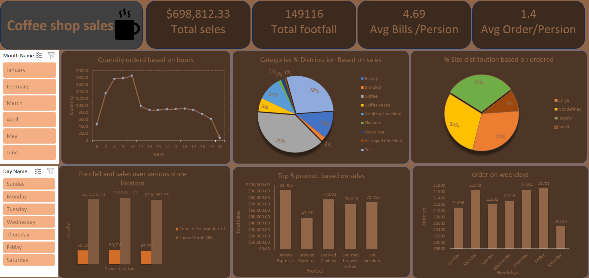

# Coffee Shop Sales Dashboard

## Project Overview

This project focuses on analyzing coffee shop sales performance, customer footfall, product demand, and customer purchasing behavior using Microsoft Excel. The dashboard provides business insights through interactive charts, KPIs, and filters to support better business decision-making.

---

## Tools Used

* Microsoft Excel
* Pivot Tables
* Pivot Charts
* Data Visualization
* Dashboard Design

---

## Business Problem

Coffee shop businesses often face challenges in understanding customer behavior, identifying top-selling products, tracking peak sales hours, and monitoring store performance. This dashboard helps analyze sales trends and operational performance using data-driven insights.

---

## Dashboard Features

* Total Sales KPI
* Customer Footfall Analysis
* Average Bill Analysis
* Hourly Order Trend Analysis
* Category-wise Sales Distribution
* Size-wise Order Distribution
* Store Location Analysis
* Product-wise Sales Analysis
* Weekday Order Analysis
* Interactive Filters and Slicers

---

## Key Insights

### 1. Total Sales Performance

* The coffee shop generated approximately $698K in total sales.
* Strong sales performance was maintained across all store locations.

---

### 2. Customer Footfall Analysis

* Total customer footfall reached 149,116 customers.
* High customer visits indicate strong business demand.

---

### 3. Average Customer Spending

* The average bill per person is 4.69.
* Most customers place medium-value orders.

---

### 4. Average Orders Per Customer

* Customers placed an average of 1.4 orders per visit.
* Single-item orders are more common among customers.

---

### 5. Peak Ordering Hours

* Orders are highest between 8 AM and 10 AM.
* Morning hours contribute maximum sales activity.

---

### 6. Category-wise Sales Analysis

* Coffee category contributes the highest overall sales.
* Tea and Bakery products also perform strongly.
* Packaged products contribute lower sales comparatively.

---

### 7. Beverage Size Analysis

* Regular-size beverages have the highest order percentage.
* Large-size drinks also contribute significantly to sales.
* Small-size beverages have lower customer preference.

---

### 8. Store Location Performance

* One store location generated the highest revenue and footfall.
* Sales distribution across locations remains relatively balanced.

---

### 9. Top-Selling Products

* Barista Espresso is among the highest revenue-generating products.
* Brewed Chai Tea and Hot Chocolate show strong sales performance.

---

### 10. Weekday Order Analysis

* Thursday and Friday recorded the highest order volumes.
* Weekend sales are relatively lower compared to weekdays.

---

## Business Impact

This dashboard helps coffee shop management understand customer behavior, optimize inventory planning, improve staffing decisions during peak hours, and increase sales performance using data insights.

---

## Project Files

* Excel Dashboard File
* Dataset
* Dashboard Screenshot

---

## Dashboard Preview

